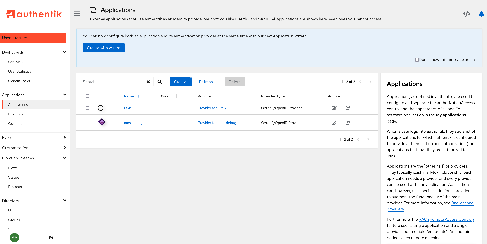
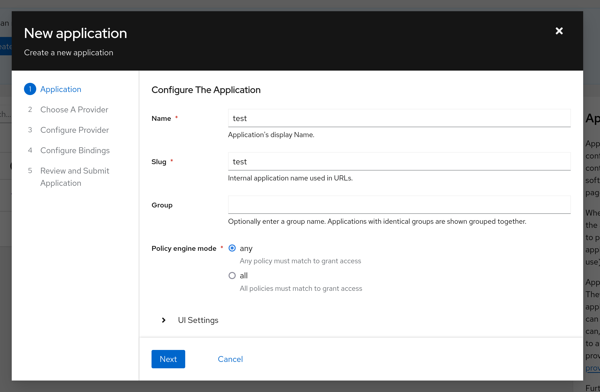
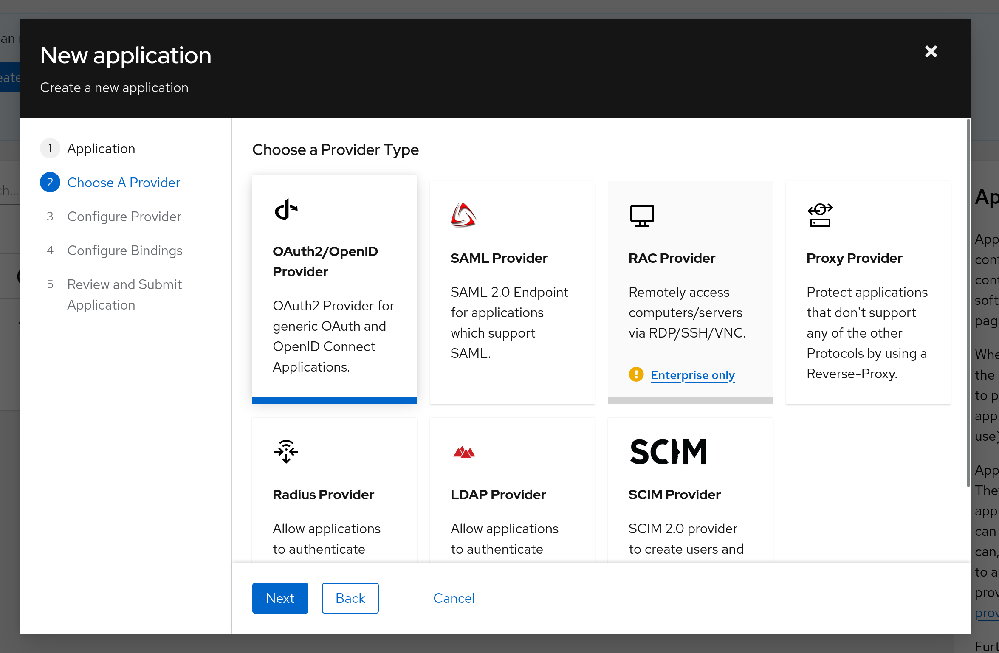
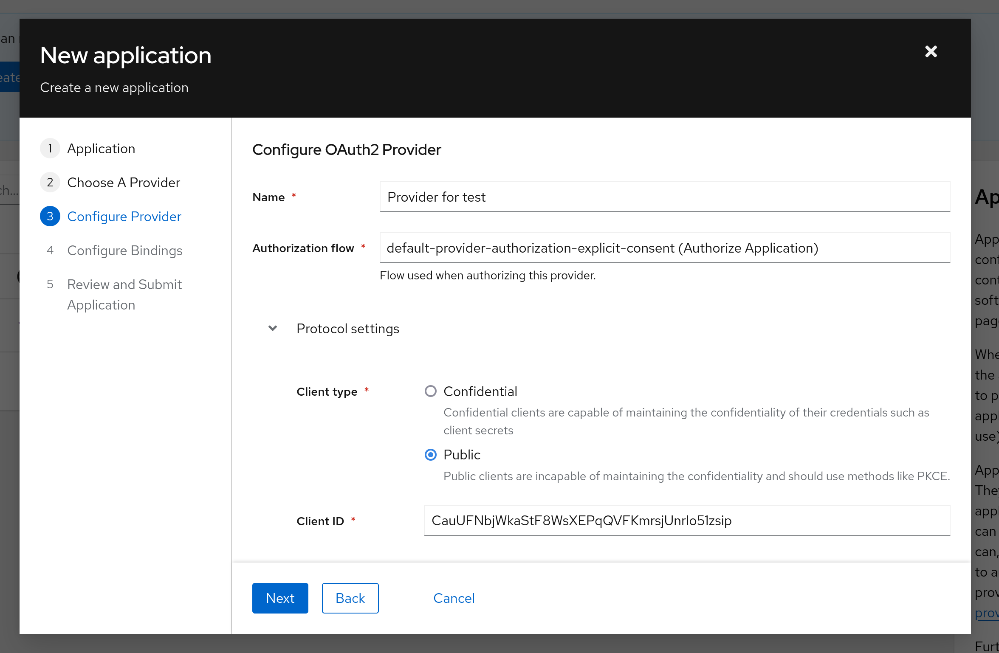
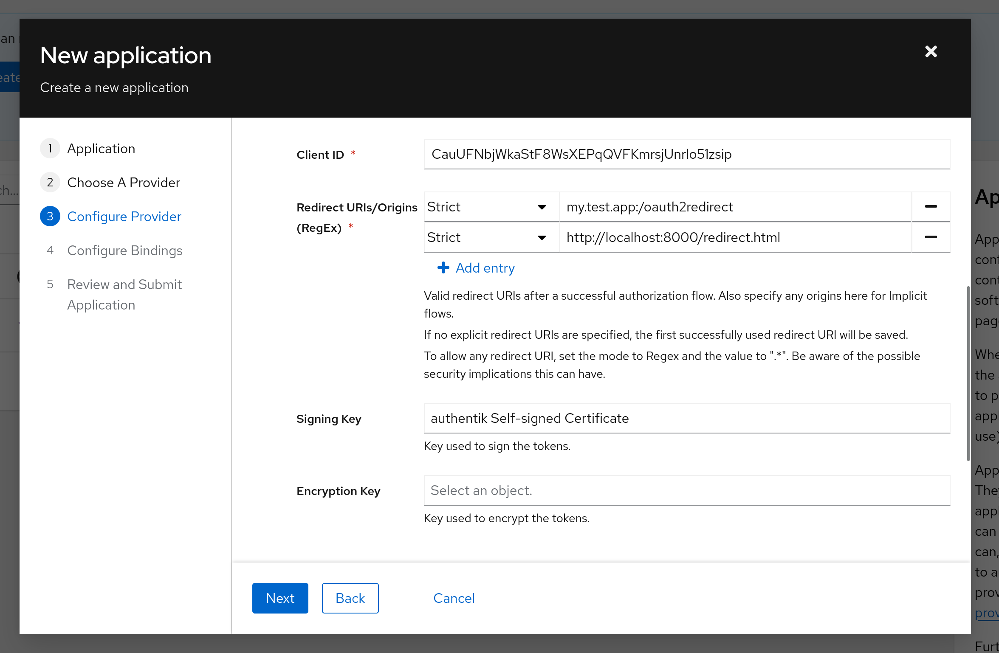
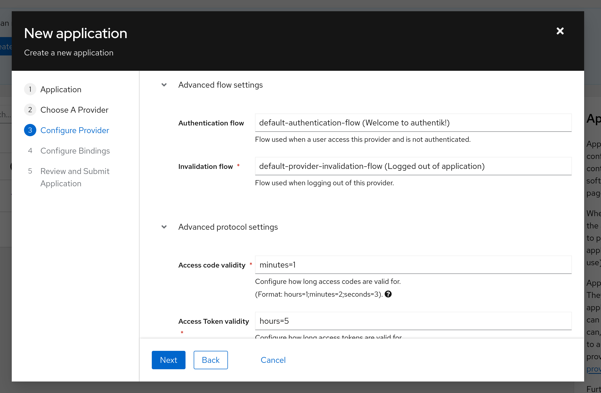
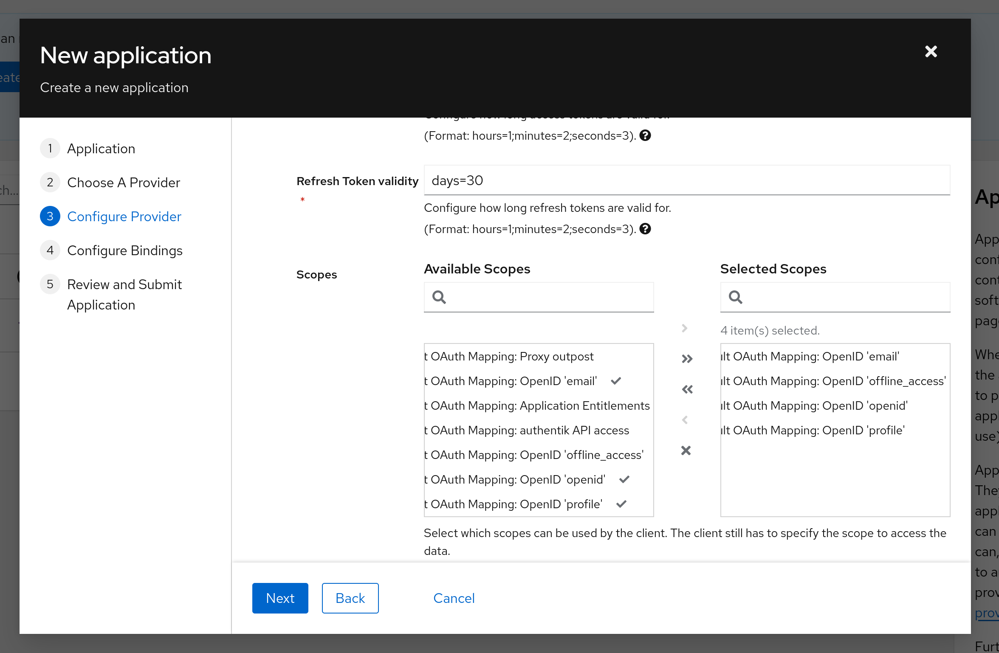
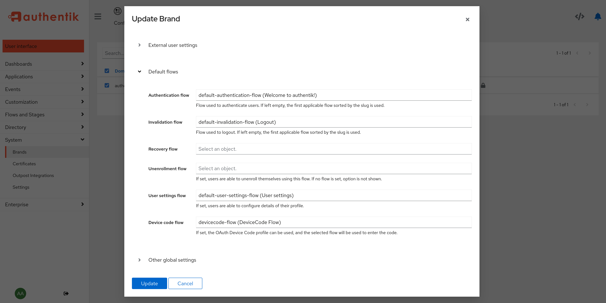

You can use any identity provider that supports OAuth with your OpenMediaStation (OMS) instance. This guide focuses on the Authentik identity provider, but the same settings can be applied to other providers.

## Creating an Application

To connect Authentik to OMS, we first need to create a public application in Authentik and save the `ClientId` and `ConfigurationURL` for later use in OMS.

To create an application, navigate to the **Applications** tab in the admin interface, as shown in the image below.

In this menu, click the `Create with wizard` button.

Enter an application name and slug (used in the URL). These values can be set freely.

After clicking **Next**, you will be prompted to choose a provider type. Select `OAuth2/OpenID Provider`.

In the next menu, configure the OAuth2 provider settings. You can choose any name. For `Authorization flow`, select `default-provider-authorization-explicit-consent` and for `ClientType`, choose `Public`.

The `Client ID` displayed now should be saved for later use in the OpenMediaStation configuration, as described in [Getting Started](../getting-started/).

Now, enter two redirect URIs:
- **Mobile apps:** `my.test.app:/oauth2redirect`
- **Desktop:** `http://localhost:8000/redirect.html`

Please enter both URIs, even if you do not plan to use a specific platform.

Next, set the `Authentication flow` to `default-authentication-flow` and adjust the `Access Token validity` to `hours=5`. *(This setting is required due to a bug in a library we use. It may be reduced in a future release or if you are using a third-party frontend application.)*

When selecting scopes, be sure to include the `offline_access` scope. After that, click **Next** to complete the application setup.

Finally, copy the `OpenID Configuration URL` of your newly created provider and proceed with the OMS installation.

> If you have not yet set up a device code flow, continue with the next section.

## Ensuring the Device Code Flow Exists

A `Device code flow` must be selected in `System/Brands/{YourBrand}/Default flows`. A default option should be available for selection.

